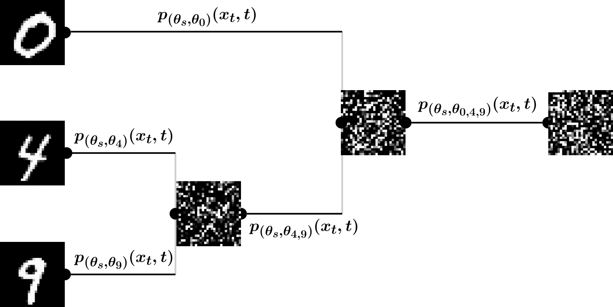

# Hierarchically branched diffusion models leverage dataset structure for class-conditional generation

<p align="center">
    
</p>

### Introduction

Diffusion models have achieved justifiable popularity by attaining state-of-the-art performance in generating realistic objects from seemingly arbitrarily complex data distributions, including when conditioning generation on labels.

Current class-conditional diffusion models, however, implicitly model the diffusion process on all classes in a flat fashion, ignoring any known relationships between classes. Class-labeled datasets, including those common in scientific domains, are rife with internal structure.

To take advantage of this structure, we propose hierarchically branched diffusion models as a novel framework for class-conditional generation. Branched diffusion models explicitly leverage the inherent relationships between distinct classes in the dataset to learn the underlying diffusion process in a hierarchical manner.

Unlike their linear counterparts, branched diffusion models can be easily extended to novel data and classes in a continual-learning setting, they enable more sophisticated forms of conditional generation such as analogy-based conditional generation (i.e. transmutation), and they offer a novel interpretability into the diffusion process. Furthermore, they are more efficient than traditional diffusion models when sampling multiple classes.

See the [corresponding paper](https://openreview.net/forum?id=sGTfxqRbei) for more information.

This repository houses all of the code used to generate the results for the paper, including code that processes data, trains models, implements branched diffusion models, and generates all figures in the paper.

### Citing this work

If you found branched diffusion models to be helpful for your work, please cite the following:

Tseng, A.M., Shen, M., Biancalani, T., Scalia, G. Hierarchically branched diffusion models leverage dataset structure for class-conditional generation. TMLR (2024) [Link](https://openreview.net/forum?id=sGTfxqRbei)

[\[BibTeX\]](references/bibtex.bib)

### Description of files and directories

```
├── Makefile    <- Installation of dependencies
├── data    <- Contains data for training and downstream analysis
│   ├── raw    <- Raw data, directly downloaded from the source
│   ├── interim    <- Intermediate data mid-processing
│   ├── processed    <- Processed data ready for training or analysis
│   └── README.md    <- Description of data
├── models
│   └── trained_models    <- Trained models
├── notebooks    <- Jupyter notebooks that explore data, plot results, and analyze results
│   └── figures    <- Jupyter notebooks that create figures
├── results    <- Saved results
├── README.md    <- This file
└── src    <- Source code
    ├── feature    <- Code for data loading and featurization
    ├── model    <- Code for model architectures and training
    ├── analysis    <- Code for analyzing results
    └── plot    <- Code for plotting and visualization
```
